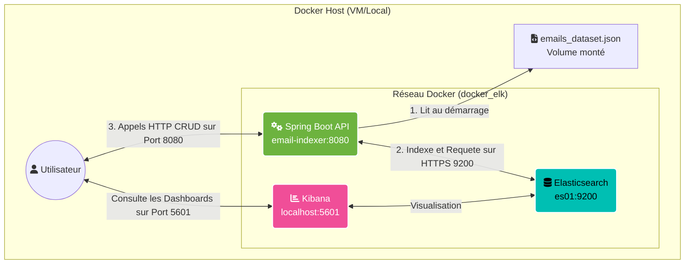
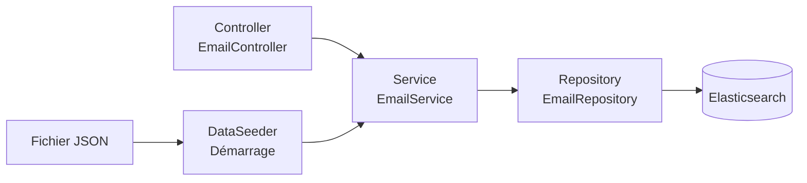

# 🎓 Atelier Pratique : Création d'un Indexeur d'Emails avec Spring Boot et Elasticsearch

Bienvenue dans ce guide d'atelier autonome (*self-paced lab*). L'objectif de cet atelier est de vous guider pas-à-pas dans la création du projet **Email Indexer**. À la fin de ce guide, vous aurez développé une API REST complète en Java (Spring Boot) capable d'ingérer un dataset JSON et d'interagir avec une stack Elasticsearch sécurisée via Docker.

---

## 🏗️ 1. Architecture du Projet

Avant de coder, comprenons comment les différentes briques communiquent entre elles.

### Diagramme d'Architecture (Infrastructure)



### Architecture Interne Spring Boot



---

## 🛠️ 2. Prérequis

Pour réaliser cet atelier, vous avez besoin de :
- **Java 17** d'installé (ou plus récent).
- **Docker** et **Docker Compose**.
- Le fichier `emails_dataset.json` placé dans un dossier `data` à la racine de votre environnement.
- Un éditeur de code (VS Code, IntelliJ IDEA).

---

## 🚀 3. Étapes de l'Atelier

### Étape 1 : Initialisation du Projet Spring Boot

La première étape consiste à générer la structure du projet Java. 
Allez sur [Spring Initializr (start.spring.io)](https://start.spring.io/) et configurez le projet ainsi :
- **Project** : Gradle - Groovy
- **Language** : Java 17
- **Spring Boot** : 3.3.0
- **Dependencies** : 
  - `Spring Web` (pour l'API REST)
  - `Spring Data Elasticsearch` (pour l'interaction avec ES)
  - `Lombok` (pour réduire le code boilerplate)

Une fois généré, décompressez le projet dans votre répertoire `email-indexer`.

> [!WARNING]
> Attention, le générateur inclut parfois des versions incompatibles entre Gradle 9.x et Spring Boot. Assurez-vous que votre fichier `gradle/wrapper/gradle-wrapper.properties` pointe vers `gradle-8.8-bin.zip`.

### Étape 2 : Configuration de la Connexion à Elasticsearch

Dans une architecture sécurisée (comme `docker_elk`), Elasticsearch utilise un certificat auto-signé HTTPS et une authentification. 
Nous devons configurer Spring Boot pour accepter cette connexion dans l'environnement de développement.

Créez une classe `ElasticConfig.java` dans le package `config` :

```java
package com.wevops.emailindexer.config;

import org.springframework.context.annotation.Configuration;
import org.springframework.data.elasticsearch.client.ClientConfiguration;
import org.springframework.data.elasticsearch.client.elc.ElasticsearchConfiguration;
import org.springframework.beans.factory.annotation.Value;
import javax.net.ssl.SSLContext;
import javax.net.ssl.TrustManager;
import javax.net.ssl.X509TrustManager;

@Configuration
public class ElasticConfig extends ElasticsearchConfiguration {

    @Value("${spring.elasticsearch.uris:http://localhost:9200}")
    private String[] uris;

    @Value("${spring.elasticsearch.username:elastic}")
    private String username;

    @Value("${spring.elasticsearch.password:}")
    private String password;

    @Override
    public ClientConfiguration clientConfiguration() {
        String uri = uris[0].replace("https://", "").replace("http://", "");
        return ClientConfiguration.builder()
                .connectedTo(uri)
                .usingSsl(getTrustAllSslContext(), (s, session) -> true) // Ignore les erreurs SSL locales
                .withBasicAuth(username, password)
                .build();
    }

    private SSLContext getTrustAllSslContext() {
        // Implémentation générique d'un TrustManager qui accepte tout
        // (voir le code final pour l'implémentation complète)
    }
}
```

### Étape 3 : Création du Modèle de Données (Model)

Il s'agit de mapper la structure JSON vers une classe Java compréhensible par Elasticsearch.
Créez `Email.java` dans le package `model` :

```java
package com.wevops.emailindexer.model;

import lombok.Data;
import org.springframework.data.annotation.Id;
import org.springframework.data.elasticsearch.annotations.Document;
import org.springframework.data.elasticsearch.annotations.Field;
import org.springframework.data.elasticsearch.annotations.FieldType;
import java.util.List;

@Data
@Document(indexName = "emails")
public class Email {
    @Id
    private String id;

    @Field(type = FieldType.Text)
    private String subject;

    @Field(type = FieldType.Date, format = {}, pattern = "uuuu-MM-dd'T'HH:mm:ss.SSSSSS")
    private String date;

    // Ajouter body, sender, recipient, attachments, tags, etc.
}
```
> [!TIP]
> Notez l'importance du `pattern` sur le champ `date`. Elasticsearch doit savoir comment parser le format microsecondes spécifique de notre jeu de données.

### Étape 4 : Le Repository (Accès aux Données)

Spring Data simplifie l'accès à la base de données via une simple interface.
Créez `EmailRepository.java` dans le package `repository` :

```java
package com.wevops.emailindexer.repository;

import com.wevops.emailindexer.model.Email;
import org.springframework.data.elasticsearch.repository.ElasticsearchRepository;
import org.springframework.stereotype.Repository;

@Repository
public interface EmailRepository extends ElasticsearchRepository<Email, String> {
    // Spring génère automatiquement save(), findById(), delete(), etc.
}
```

### Étape 5 : Logique Métier (Service) et API (Controller)

Créez `EmailService.java` pour isoler la logique métier, et `EmailController.java` pour exposer vos Endpoints.

**Exemple partiel du Controller :**
```java
@RestController
@RequestMapping("/api/emails")
@RequiredArgsConstructor
public class EmailController {
    private final EmailService emailService;

    @GetMapping
    public ResponseEntity<List<Email>> getAll() {
        return ResponseEntity.ok(emailService.getAll());
    }

    @PostMapping
    public ResponseEntity<Email> create(@RequestBody Email email) {
        return ResponseEntity.ok(emailService.create(email));
    }
}
```

### Étape 6 : Ingestion Initiale Automatique (DataSeeder)

L'objectif est que notre API lise notre gros fichier `emails_dataset.json` au démarrage.
Créez `DataSeeder.java` (qui implémente `CommandLineRunner`) :

```java
@Component
@RequiredArgsConstructor
@Slf4j
public class DataSeeder implements CommandLineRunner {
    private final EmailService emailService;
    private final ObjectMapper objectMapper;

    @Override
    public void run(String... args) throws Exception {
        File file = new File("/data/emails_dataset.json");
        if (file.exists()) {
            List<Email> emails = objectMapper.readValue(file, new TypeReference<List<Email>>() {});
            emailService.createAll(emails);
            log.info("Chargement réussi : {} emails.", emails.size());
        }
    }
}
```

### Étape 7 : Conteneurisation (Docker)

Au lieu d'exiger Java sur le serveur de production, nous embarquons l'application dans une image Docker en deux étapes (Compilation + Exécution).

Créez le fichier `Dockerfile` :
```dockerfile
# Étape 1 : Compilation (JDK)
FROM eclipse-temurin:17-jdk-alpine AS build
WORKDIR /workspace/app
COPY . .
RUN chmod +x ./gradlew
RUN ./gradlew build -x test
RUN mkdir -p build/dependency && (cd build/dependency; jar -xf ../libs/*-SNAPSHOT.jar)

# Étape 2 : Exécution (JRE plus léger)
FROM eclipse-temurin:17-jre-alpine
VOLUME /tmp
ARG DEPENDENCY=/workspace/app/build/dependency
COPY --from=build ${DEPENDENCY}/BOOT-INF/lib /app/lib
COPY --from=build ${DEPENDENCY}/META-INF /app/META-INF
COPY --from=build ${DEPENDENCY}/BOOT-INF/classes /app
ENTRYPOINT ["java","-cp","app:app/lib/*","com.wevops.emailindexer.EmailIndexerApplication"]
```

### Étape 8 : Déploiement et Test avec Docker Compose

Intégrez l'application à votre stack existante (votre fichier `docker-compose.yml`) :

```yaml
  email-indexer:
    build: ./email-indexer
    environment:
      - ELASTICSEARCH_URIS=https://es01:9200
      - SPRING_ELASTICSEARCH_USERNAME=elastic
      - SPRING_ELASTICSEARCH_PASSWORD=${ELASTIC_PASSWORD}
    volumes:
      - ../data:/data:ro
    ports:
      - "8080:8080"
    depends_on:
      es01:
        condition: service_healthy
```

> [!IMPORTANT]
> - `depends_on` avec `service_healthy` garantit que l'API ne démarre que quand Elasticsearch est complètement prêt et sécurisé.
> - Le volume mappé `../data:/data:ro` permet au DataSeeder de trouver le fichier `emails_dataset.json` local.

---

## 🎯 Validation Finale de l'Atelier

1. Construisez et lancez la stack : `docker compose up -d --build`
2. Regardez les logs : `docker compose logs -f email-indexer`
3. Validez avec les tests curl ci-dessous.

---

## 🧪 9. Tests des API avec curl

Une fois la stack lancée, l'API est disponible sur `http://localhost:8080/api/emails`.
Voici les commandes curl pour tester **chaque endpoint CRUD**.

> [!TIP]
> Installez `jq` pour afficher le JSON en couleur : `sudo apt install jq` (Linux) ou `choco install jq` (Windows).

### 9.1 — CREATE : Créer un email (`POST`)

```bash
curl -s -X POST http://localhost:8080/api/emails \
  -H "Content-Type: application/json" \
  -d '{
    "subject": "Alerte de sécurité - Test QRQC",
    "body": "Ceci est un email de test créé via API curl pour valider le pipeline Spring Boot → Elasticsearch.",
    "sender": "admin@wevops.com",
    "recipient": "security-team@wevops.com",
    "date": "2026-06-26T15:00:00.000000",
    "tags": ["test", "qrqc", "curl"],
    "attack_type": "phishing",
    "attachments": [
      {
        "filename": "rapport_test.pdf",
        "content_type": "application/pdf"
      }
    ],
    "ioc": [
      {
        "indicator": "192.168.1.100",
        "type": "ip"
      },
      {
        "indicator": "malware.example.com",
        "type": "domain"
      }
    ]
  }' | jq
```

**Réponse attendue** (HTTP 200) :
```json
{
  "id": "abc123...",
  "subject": "Alerte de sécurité - Test QRQC",
  "sender": "admin@wevops.com",
  ...
}
```

> [!IMPORTANT]
> Notez le champ `"id"` retourné dans la réponse. Copiez-le pour les prochaines commandes.
> Remplacez `<ID>` ci-dessous par cette valeur.

---

### 9.2 — READ : Lire un email par son ID (`GET /{id}`)

```bash
curl -s -X GET http://localhost:8080/api/emails/<ID> | jq
```

**Réponse attendue** (HTTP 200) : Le document complet de l'email créé à l'étape 9.1.

**En cas d'ID inexistant** (HTTP 404) :
```bash
curl -s -o /dev/null -w "HTTP Status: %{http_code}\n" \
  http://localhost:8080/api/emails/id_inexistant_12345
```
> Résultat : `HTTP Status: 404`

---

### 9.3 — READ ALL : Lister tous les emails (`GET`)

```bash
curl -s -X GET http://localhost:8080/api/emails | jq length
```

Cette commande retourne le **nombre total** d'emails indexés.
Si le `DataSeeder` a fonctionné, vous devriez obtenir **3606** (ou plus si vous avez créé des emails manuellement).

Pour afficher les **5 premiers** :
```bash
curl -s -X GET http://localhost:8080/api/emails | jq '.[0:5]'
```

---

### 9.4 — UPDATE : Mettre à jour un email (`PUT /{id}`)

```bash
curl -s -X PUT http://localhost:8080/api/emails/<ID> \
  -H "Content-Type: application/json" \
  -d '{
    "subject": "Alerte de sécurité - MISE A JOUR",
    "body": "Ce body a été modifié via un appel PUT curl.",
    "sender": "admin@wevops.com",
    "recipient": "ciso@wevops.com",
    "date": "2026-06-26T16:30:00.000000",
    "tags": ["test", "qrqc", "curl", "updated"],
    "attack_type": "spear-phishing",
    "attachments": [
      {
        "filename": "rapport_v2.pdf",
        "content_type": "application/pdf"
      }
    ],
    "ioc": [
      {
        "indicator": "10.0.0.50",
        "type": "ip"
      }
    ]
  }' | jq
```

**Réponse attendue** (HTTP 200) : Le document mis à jour avec les nouveaux champs.

Vérifiez la mise à jour en relisant :
```bash
curl -s http://localhost:8080/api/emails/<ID> | jq '.subject, .recipient, .tags'
```
> Résultat : `"Alerte de sécurité - MISE A JOUR"`, `"ciso@wevops.com"`, `["test","qrqc","curl","updated"]`

---

### 9.5 — DELETE : Supprimer un email (`DELETE /{id}`)

```bash
curl -s -o /dev/null -w "HTTP Status: %{http_code}\n" \
  -X DELETE http://localhost:8080/api/emails/<ID>
```

**Réponse attendue** : `HTTP Status: 204` (No Content — suppression réussie).

Confirmez la suppression :
```bash
curl -s -o /dev/null -w "HTTP Status: %{http_code}\n" \
  http://localhost:8080/api/emails/<ID>
```
> Résultat : `HTTP Status: 404` (l'email n'existe plus).

---

### 9.6 — Script de test complet (enchaînement automatique)

Copiez ce script Bash pour exécuter le cycle CRUD complet en une seule commande :

```bash
#!/bin/bash
# test_api.sh — Test complet CRUD Email Indexer
BASE_URL="http://localhost:8080/api/emails"

echo "========================================"
echo "   TEST CRUD — Email Indexer API"
echo "========================================"

# 1. CREATE
echo -e "\n🟢 1. POST — Création d'un email..."
RESPONSE=$(curl -s -X POST "$BASE_URL" \
  -H "Content-Type: application/json" \
  -d '{
    "subject": "Email de test automatique",
    "body": "Créé par le script de test CRUD.",
    "sender": "test@wevops.com",
    "recipient": "qa@wevops.com",
    "date": "2026-06-26T12:00:00.000000",
    "tags": ["auto-test"],
    "attack_type": "none",
    "attachments": [],
    "ioc": []
  }')
echo "$RESPONSE" | jq
ID=$(echo "$RESPONSE" | jq -r '.id')
echo "   → ID créé : $ID"

# 2. READ by ID
echo -e "\n🔵 2. GET /$ID — Lecture par ID..."
curl -s "$BASE_URL/$ID" | jq

# 3. READ ALL (count)
echo -e "\n🔵 3. GET / — Nombre total d'emails..."
COUNT=$(curl -s "$BASE_URL" | jq length)
echo "   → Total : $COUNT emails"

# 4. UPDATE
echo -e "\n🟡 4. PUT /$ID — Mise à jour..."
curl -s -X PUT "$BASE_URL/$ID" \
  -H "Content-Type: application/json" \
  -d '{
    "subject": "Email modifié par le script",
    "body": "Body mis à jour.",
    "sender": "test@wevops.com",
    "recipient": "devops@wevops.com",
    "date": "2026-06-26T13:00:00.000000",
    "tags": ["auto-test", "updated"],
    "attack_type": "none",
    "attachments": [],
    "ioc": []
  }' | jq '.subject, .recipient'

# 5. DELETE
echo -e "\n🔴 5. DELETE /$ID — Suppression..."
HTTP_CODE=$(curl -s -o /dev/null -w "%{http_code}" -X DELETE "$BASE_URL/$ID")
echo "   → HTTP Status : $HTTP_CODE"

# 6. Vérification
echo -e "\n🔍 6. Vérification — L'email doit être 404..."
HTTP_CODE=$(curl -s -o /dev/null -w "%{http_code}" "$BASE_URL/$ID")
echo "   → HTTP Status : $HTTP_CODE"

echo -e "\n========================================"
echo "   ✅ TEST TERMINÉ"
echo "========================================"
```

Lancez-le :
```bash
chmod +x test_api.sh && ./test_api.sh
```

---

### 📊 Tableau récapitulatif des Endpoints

| Méthode  | Endpoint              | Description                    | Code Succès |
|----------|-----------------------|--------------------------------|-------------|
| `POST`   | `/api/emails`         | Créer un nouvel email          | `200`       |
| `GET`    | `/api/emails/{id}`    | Lire un email par son ID       | `200`       |
| `GET`    | `/api/emails`         | Lister tous les emails         | `200`       |
| `PUT`    | `/api/emails/{id}`    | Mettre à jour un email         | `200`       |
| `DELETE` | `/api/emails/{id}`    | Supprimer un email             | `204`       |

---

## 🔎 10. Vérification dans Kibana

1. Connectez-vous sur **Kibana** : `http://localhost:5601`
2. Allez dans **Stack Management → Data Views** et créez une *Data View* ciblant l'index `emails`
3. Accédez à **Discover** pour visualiser toutes les données ingérées
4. Essayez des requêtes KQL dans la barre de recherche :
   ```
   subject: "sécurité" AND tags: "test"
   ```

*Félicitations, vous avez mené à bien l'intégration complète d'une API Java / Elasticsearch dans un environnement Dockerisé sécurisé !* 🎉
