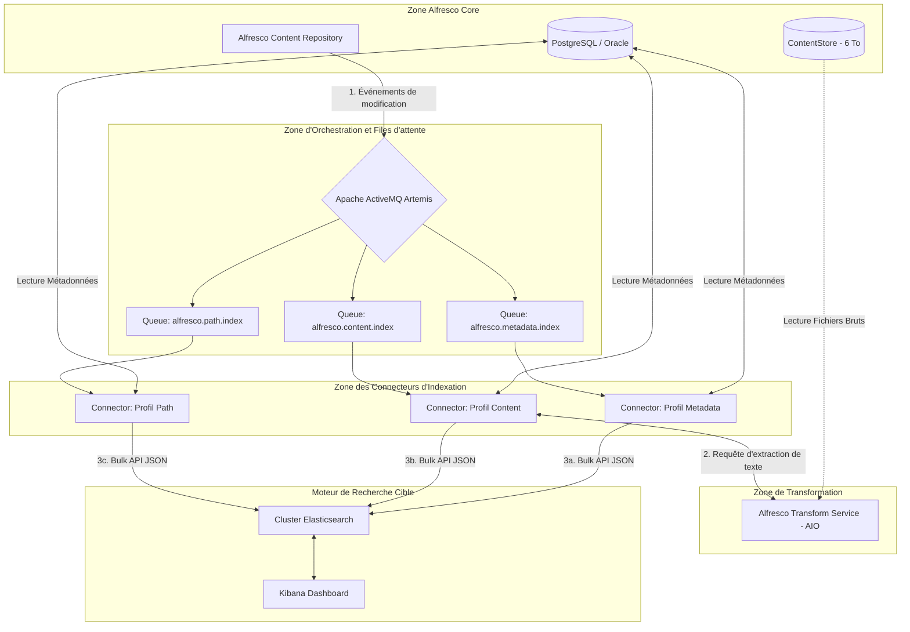

# Dossier d'Architecture de Migration et de Validation de Performance : Alfresco Solr vers Elasticsearch (6 To+)

Ce document constitue la spécification technique officielle de référence pour le projet de migration du moteur de recherche d'Alfresco Content Services (ACS) depuis Solr (Search Services) vers Elasticsearch (Search Enterprise).  
Il intègre l'analyse d'impact d'ingestion à grande échelle, les diagrammes d'architecture, la configuration d'orchestration de test et le plan de capacity planning de production.

---

## 1. Executive Summary & Défi des 6 To

La migration d'un système d'archivage documentaire Alfresco de 6 To (représentant plusieurs millions de nœuds documentaires) vers un nouveau moteur d'indexation ne peut s'effectuer par un simple transfert de fichiers. Elle impose de reconstruire intégralement l'index de recherche à partir des données sources.

Les contraintes critiques d'un tel projet sont les suivantes :

- **Saturation CPU par l'extraction textuelle :** L'analyse des types de fichiers (PDF, Word, Images, etc.) via Apache Tika consomme d'importantes ressources de calcul. Sur 6 To, le temps d'exécution peut s'étendre sur plusieurs semaines si la charge n'est pas distribuée.
- **Impact sur la production (Bases de données / API) :** La phase de réindexation historique ne doit pas altérer les temps de réponse de la plateforme Alfresco utilisée au quotidien par les collaborateurs.
- **Pression d'écriture sur Elasticsearch :** Le cluster cible doit être configuré pour absorber un flux continu d'indexation massive sans subir de pannes mémoire (Out Of Memory).

---

## 2. Révolution Architecturale : Du Modèle "Pull" au Modèle "Push"

L'architecture moderne d'Alfresco Search Enterprise rompt radicalement avec le couplage historique entre le Repository et Solr.

**MODÈLE HISTORIQUE "PULL" (SOLR) :**

```
[ Alfresco Repository ] <====== (Requêtes HTTP Polling régulières) ====== [ Solr Search Services ]
```

**MODÈLE MODERNE "PUSH" (ELASTICSEARCH) :**

```
[ Alfresco Repository ] ──(Événements asynchrones)──> [ ActiveMQ ] ──► [ Connecteurs ] ──► [ Elasticsearch ]
```

### Matrice comparative des deux modèles

| Caractéristique | Ancienne Architecture (Solr / Search Services) | Nouvelle Architecture (Elasticsearch / Search Enterprise) |
| :--- | :--- | :--- |
| **Mécanisme de capture** | Pull (Solr interroge régulièrement l'API d'ACS) | Push (ACS émet des messages d'événements à chaque transaction) |
| **Gestion de la charge** | Synchrone / Fortement couplée | Asynchrone / Découplée via un courtier de messages (Message Broker) |
| **Goulot d'étranglement** | Limité par les capacités de calcul du serveur Solr unique | Aucun (Scalabilité horizontale linéaire des connecteurs de calcul) |
| **Format intermédiaire** | Indexation propriétaire Lucene | Documents structurés JSON standardisés de type `document-store` |

---

## 3. Schéma de l'Architecture Cible (Modèle Événementiel)

Le diagramme ci-dessous présente l'infrastructure cible découplée et la répartition des flux asynchrones :



---

## 4. Rôles et Spécifications des Connecteurs d'Indexation

Pour assurer une scalabilité maximale, l'application Alfresco Elasticsearch Connector segmente ses responsabilités d'ingestion à travers trois profils distincts :

### A. Connecteur de Métadonnées (Profil `metadata`)
- **Mission :** Traiter les aspects, types et permissions d'accès.
- **Comportement :** Écoute la file `alfresco.metadata.index`. Il extrait les informations de la base de données relationnelle d'Alfresco, construit les propriétés basiques du document JSON et prépare la structure de contrôle d'accès (ACL).
- **Mise à l'échelle :** Très élevée (faible consommation CPU/Mémoire).

### B. Connecteur de Contenu (Profil `content`)
- **Mission :** Extraire et indexer le texte intégral des fichiers binaires.
- **Comportement :** Écoute la file `alfresco.content.index`. Il récupère le fichier physique sur le ContentStore, sollicite l'Alfresco Transform Service pour la conversion en texte brut (via Apache Tika), puis injecte ce contenu textuel dans le champ `content.text` d'Elasticsearch.
- **Mise à l'échelle :** Maximale. C'est ce composant qui doit être multiplié (scale-up) pour absorber les 6 To de données.

### C. Connecteur d'Arborescence (Profil `path`)
- **Mission :** Garantir la cohérence des chemins de dossiers et l'héritage des droits d'accès.
- **Comportement :** Écoute la file `alfresco.path.index`. Il recalcule la position hiérarchique du document dans l'arborescence documentaire d'Alfresco.
- **Mise à l'échelle :** Strictement unitaire (Single Consumer).

> ⚠️ **Alerte d'Architecture :** Pour préserver l'intégrité de la structure des dossiers et éviter les collisions d'écritures concurrentielles dans Elasticsearch (`VersionConflictEngineException`), vous devez configurer ce worker avec une seule et unique instance active.

---

## 5. Déroulement de la Migration Initiale (Massive Reindexing)

Pendant la migration historique initiale, vous utiliserez l'outil Alfresco Elasticsearch Reindexing Application pour numériser la base de données existante et piloter la reconstruction de l'index de recherche :

```mermaid
sequenceDiagram
    autonumber
    participant DB as Base de Données (Postgres)
    participant REINDEX as Job de Réindexation (CLI)
    participant AMQ as ActiveMQ Artemis
    participant CONN as Connecteur (Workers)
    participant ATS as Transform Service (Tika)
    participant ES as Cluster Elasticsearch

    Note over REINDEX: 1. Initialisation de la Migration
    REINDEX->>DB: Scan de la table ALF_NODE (Définition du Max ID)
    DB-->>REINDEX: Max ID = 15 000 000

    Note over REINDEX: 2. Phase de Découpage en Lots (Batching)
    Loop Par pages de 10 000 nœuds
        REINDEX->>DB: Lecture d'un bloc d'IDs de nœuds
        DB-->>REINDEX: Liste des IDs [N-N+10000]
        REINDEX->>AMQ: Publication de messages individuels (JSON léger)
        Note over AMQ: Remplissage des files d'attente
    end

    Note over CONN,ATS: 3. Traitement Asynchrone en Parallèle
    Parallèle entre les N instances de Connecteurs
        CONN->>AMQ: Consommation des messages (Ack)
        CONN->>DB: Récupération des propriétés du nœud
        DB-->>CONN: Propriétés & ACLs du document
        
        opt Si le document possède un fichier binaire (6 To de stockage)
            CONN->>ATS: Envoi du binaire pour extraction textuelle
            ATS-->>CONN: Retour du texte extrait (Plain Text)
        end
        
        CONN->>CONN: Assemblage du document JSON final
        CONN->>ES: Envoi du document via l'API _bulk (lots de 1000)
    end
```

---

## 6. Environnement Local Prêt à Déployer (Docker-Compose & Automatisation)

Afin de valider la stack technologique, un environnement local entièrement automatisé est décrit ci-dessous. Il intègre un conteneur d'injection de données de démo (`dataset-injector`) qui prépare le terrain de test avant le lancement automatique de la réindexation.

### A. Configuration de la Stack : `docker-compose.yml`

```yaml
version: '3.8'

services:
  # Base de données PostgreSQL transactionnelle d'Alfresco
  postgres:
    image: postgres:14.4
    environment:
      POSTGRES_DB: alfresco
      POSTGRES_USER: alfresco
      POSTGRES_PASSWORD: password
    ports:
      - "5432:5432"
    volumes:
      - postgres-data:/var/lib/postgresql/data
    healthcheck:
      test: ["CMD-SHELL", "pg_isready -U alfresco"]
      interval: 5s
      timeout: 5s
      retries: 5

  # Message Broker asynchrone (ActiveMQ Artemis)
  activemq:
    image: apache/activemq-artemis:2.23.0-alpine
    environment:
      ARTEMIS_USER: admin
      ARTEMIS_PASSWORD: admin_password
    ports:
      - "61616:61616" 
      - "8161:8161"   
    healthcheck:
      test: ["CMD-SHELL", "nc -z localhost 61616 || exit 1"]
      interval: 5s
      timeout: 5s
      retries: 5

  # Cluster de Recherche Elasticsearch (Nœud unique pour test local)
  elasticsearch:
    image: docker.elastic.co/elasticsearch/elasticsearch:7.17.10
    environment:
      - discovery.type=single-node
      - bootstrap.memory_lock=true
      - "ES_JAVA_OPTS=-Xms2g -Xmx2g"
    ulimits:
      memlock:
        soft: -1
        hard: -1
    ports:
      - "9200:9200"
    healthcheck:
      test: ["CMD-SHELL", "curl -s http://localhost:9200/_cluster/health | grep -q '\"status\":\"green\"\\|\"status\":\"yellow\"'"]
      interval: 5s
      timeout: 5s
      retries: 5

  # Console d'administration Kibana
  kibana:
    image: docker.elastic.co/kibana/kibana:7.17.10
    ports:
      - "5601:5601"
    depends_on:
      elasticsearch:
        condition: service_healthy

  # Repository Core Alfresco
  alfresco:
    image: alfresco/alfresco-content-repository:7.4.0
    environment:
      - JAVA_OPTS=-Ddb.driver=org.postgresql.Driver -Ddb.username=alfresco -Ddb.password=password -Ddb.url=jdbc:postgresql://postgres:5432/alfresco -Dmessaging.subsystem.autoStart=true -Devents.subsystem.autoStart=true -Dmessaging.broker.url=failover:(tcp://activemq:61616)
    ports:
      - "8080:8080"
    depends_on:
      postgres:
        condition: service_healthy
      activemq:
        condition: service_healthy
    healthcheck:
      test: ["CMD-SHELL", "curl -s -u admin:admin http://localhost:8080/alfresco/api/-default-/public/alfresco/versions/1/probes/-ready- | grep -q '\"status\":\"Green\"' || exit 1"]
      interval: 10s
      timeout: 10s
      retries: 10

  # Service d'extraction de contenu (Apache Tika)
  transform-service:
    image: alfresco/alfresco-transform-core-aio:3.0.0
    ports:
      - "8090:8090"

  # WORKER 1 : Traitement asynchrone des métadonnées
  elasticsearch-connector-metadata:
    image: alfresco/alfresco-elasticsearch-connector:3.0.0
    environment:
      - ALFRESCO_ACTIVEMQ_URL=tcp://activemq:61616
      - ALFRESCO_ELASTICSEARCH_HOST=elasticsearch
      - ALFRESCO_ELASTICSEARCH_PORT=9200
      - SPRING_PROFILES_ACTIVE=metadata
    depends_on:
      activemq:
        condition: service_healthy
      elasticsearch:
        condition: service_healthy

  # WORKER 2 : Traitement asynchrone des binaires
  elasticsearch-connector-content:
    image: alfresco/alfresco-elasticsearch-connector:3.0.0
    environment:
      - ALFRESCO_ACTIVEMQ_URL=tcp://activemq:61616
      - ALFRESCO_ELASTICSEARCH_HOST=elasticsearch
      - ALFRESCO_ELASTICSEARCH_PORT=9200
      - ALFRESCO_TRANSFORM_URL=http://transform-service:8090
      - SPRING_PROFILES_ACTIVE=content
    depends_on:
      activemq:
        condition: service_healthy
      elasticsearch:
        condition: service_healthy

  # WORKER 3 : Reconstruction de la hiérarchie de répertoires (Replica = 1)
  elasticsearch-connector-path:
    image: alfresco/alfresco-elasticsearch-connector:3.0.0
    environment:
      - ALFRESCO_ACTIVEMQ_URL=tcp://activemq:61616
      - ALFRESCO_ELASTICSEARCH_HOST=elasticsearch
      - ALFRESCO_ELASTICSEARCH_PORT=9200
      - SPRING_PROFILES_ACTIVE=path
    deploy:
      replicas: 1
    depends_on:
      activemq:
        condition: service_healthy
      elasticsearch:
        condition: service_healthy

  # Injecteur automatisé de documents de démo
  dataset-injector:
    image: curlimages/curl:7.85.0
    entrypoint: ["/bin/sh", "/scripts/dataset-injector.sh"]
    volumes:
      - ./scripts:/scripts
    depends_on:
      alfresco:
        condition: service_healthy

  # Job d'exécution de la réindexation complète de la base de données
  alfresco-reindexing-job:
    image: alfresco/alfresco-elasticsearch-reindexing:3.0.0
    environment:
      - ALFRESCO_ACTIVEMQ_URL=tcp://activemq:61616
      - SPRING_DATASOURCE_URL=jdbc:postgresql://postgres:5432/alfresco
      - SPRING_DATASOURCE_USERNAME=alfresco
      - SPRING_DATASOURCE_PASSWORD=password
      - SPRING_DATASOURCE_DRIVER_CLASS_NAME=org.postgresql.Driver
      - ALFRESCO_REINDEX_PAGESIZE=100
      - ALFRESCO_REINDEX_BATCHSIZE=50
    command: >
      --alfresco.reindex.jobName=reindexByIds
      --alfresco.reindex.fromId=0
      --alfresco.reindex.toId=100000
    depends_on:
      postgres:
        condition: service_healthy
      activemq:
        condition: service_healthy
      dataset-injector:
        condition: service_completed_successfully

volumes:
  postgres-data:
```

### B. Script de Bootstrap de l'injecteur : `scripts/dataset-injector.sh`

```sh
#!/bin/sh
set -e

echo "=== [1/3] Attente de la disponibilité de l'API REST d'Alfresco ==="
until curl -s -u admin:admin "http://alfresco:8080/alfresco/api/-default-/public/alfresco/versions/1/probes/-ready-" | grep -q '"status":"Green"'; do
  echo "Alfresco démarre... attente de 5 secondes."
  sleep 5
done

echo "=== [2/3] Création du dossier de test pour le Benchmark ==="
FOLDER_RESPONSE=$(curl -s -u admin:admin -X POST \
  -H "Content-Type: application/json" \
  -d '{"name": "Large-Scale-Benchmark", "nodeType": "cm:folder"}' \
  "http://alfresco:8080/alfresco/api/-default-/public/alfresco/versions/1/nodes/-root-/children")

FOLDER_ID=$(echo "$FOLDER_RESPONSE" | grep -o '"id":"[^"]*' | head -n 1 | cut -d'"' -f4)
echo "Espace de test initialisé avec succès. ID : $FOLDER_ID"

echo "=== [3/3] Téléversement des documents de test (Données textuelles) ==="
for i in $(seq 1 150); do
  FILE_PATH="/tmp/perf_doc_$i.txt"
  echo "Document indexé ID: $i. Ce fichier texte simule la charge de calcul liée à l'extraction de métadonnées et de contenu brut textuel pour évaluer les performances de notre architecture cible Elasticsearch." > "$FILE_PATH"
  
  curl -s -o /dev/null -X POST -u admin:admin \
    -F "filedata=@$FILE_PATH" \
    -F "filename=Performance_Doc_$i.txt" \
    "http://alfresco:8080/alfresco/api/-default-/public/alfresco/versions/1/nodes/$FOLDER_ID/children"
  
  rm -f "$FILE_PATH"
done

echo "✔ Téléversement des données d'évaluation achevé. Lancement automatique de la réindexation de masse..."
```

---

## 7. Plan de Validation de Performance & Campagne de Benchmark

Pour estimer précisément la vitesse d'ingestion de vos données, pilotez et contrôlez le comportement de l'infrastructure à l'aide de ces métriques clés :

### A. Contrôle de Flux et Rétention (ActiveMQ Artemis)

- **Connectez-vous** à la console d'administration ActiveMQ :
  - URL : `http://localhost:8161`
  - Identifiants : `admin` / `admin_password`
- **Analysez** l'état des files d'attente. Si la queue `alfresco.content.index` stagne à un volume de messages en attente trop élevé alors que le CPU d'Elasticsearch est faible, votre goulet d'étranglement réside dans le processus de transformation des fichiers en texte.
- **Action corrective :** Augmentez le nombre d'instances de connecteurs de contenu en exécutant à chaud la commande suivante dans votre terminal :
  ```bash
  docker-compose up -d --scale elasticsearch-connector-content=4
  ```

### B. Contrôle du Débit d'Ingestion (Elasticsearch Count API)

Mesurez le nombre total de documents indexés avec succès en interrogeant directement l'API d'Elasticsearch :

```bash
curl -X GET "http://localhost:9200/alfresco/_count?pretty"
```

Calculez votre débit d'indexation brut :
$$ \text{Vitesse} = \frac{\Delta \text{ Documents}}{\Delta \text{ Temps (secondes)}} $$

### C. Validation Structurelle des JSON d'Indexation

Assurez-vous que le connecteur compile de manière conforme les permissions complexes d'Alfresco et l'extraction de contenu Apache Tika au sein du document JSON indexé :

```bash
curl -X GET "http://localhost:9200/alfresco/_search?q=content.text:extraction&pretty"
```

---

## 8. Sizing & Configuration de Production pour un Volume de 6 To

Le passage à la production pour 6 To de données réelles requiert un calibrage d'architecture robuste.

### A. Paramétrage Elasticsearch Temporaire pour Migration Massive

Pendant la phase initiale de réindexation des 6 To, configurez l'index cible en mode d'écriture pure afin de minimiser les entrées/sorties de disque et le trafic réseau superflu :

```bash
curl -XPUT "http://localhost:9200/alfresco/_settings" -H 'Content-Type: application/json' -d'
{
  "index" : {
    "refresh_interval" : "-1",
    "number_of_replicas" : 0
  }
}'
```

- `refresh_interval: "-1"` : Désactive le processus de rafraîchissement continuel des segments de recherche en mémoire vers le disque (Lucene segment merge).
- `number_of_replicas: 0` : Supprime la duplication synchrone des données sur d'autres nœuds de données du cluster pendant l'indexation.

Une fois l'ingestion initiale terminée, réactivez la résilience et la fraîcheur d'indexation :

```bash
curl -XPUT "http://localhost:9200/alfresco/_settings" -H 'Content-Type: application/json' -d'
{
  "index" : {
    "refresh_interval" : "1s",
    "number_of_replicas" : 1
  }
}'
```

### B. Calcul du Sharding (Capacity Planning)

L'indexation de métadonnées et du contenu de fichiers d'une volumétrie binaire brute de 6 To représente en moyenne une empreinte d'indexation Elasticsearch finale de 10% à 15% (soit environ 600 Go à 900 Go de données d'index).

La recommandation pour la recherche d'entreprise est de maintenir la taille d'un shard entre 30 Go et 50 Go :

$$ \text{Nombre de shards primaires requis} = \frac{900\text{ Go}}{45\text{ Go}} = 20\text{ shards primaires} $$

Vous devez définir l'index `alfresco` avec **20 shards primaires** lors de son initialisation.

### C. Topologie Recommandée du Cluster Elasticsearch en Production

Pour supporter 6 To de données avec des temps de réponse sous la seconde en production, appliquez la configuration matérielle suivante :

- **3 Nœuds de Données Dédiés (Data Nodes) :**
  - **Processeur :** 8 à 16 Cores CPU.
  - **Mémoire Vive :** 32 Go RAM par nœud (la taille de la heap JVM configurée à 16 Go pour préserver 16 Go de cache OS pour le système de fichiers Lucene).
  - **Stockage :** Disques SSD de classe entreprise locaux (NVMe recommandés) pour supporter un haut niveau d'I/O.
- **3 Nœuds Maîtres Dédiés (Dedicated Master Nodes) :**
  - **Ressources :** 8 Go RAM, 2 à 4 Cores CPU.
  - **Mission :** Coordonner les états du cluster, gérer le quorum et éviter la situation de partitionnement de réseau (*Split-Brain*).
- **1 Nœud de Coordonnateur (Coordination Node) :**
  - **Ressources :** 8 Go RAM, 2 à 4 Cores CPU.   
- **1 Nœud de Supervision (Monitoring Node) :**
  - **Ressources :** 8 Go RAM, 2 à 4 Cores CPU. 